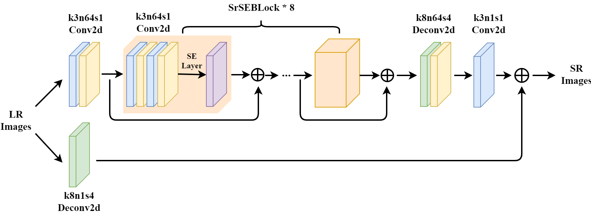

# SrSENet.pytorch

Implement of our paper "[Single Image Super-Resolution UsingSqueeze-and-Excitation Networks](http://www.kfm.cat/pdf/SrSeNet_Latex.pdf)"



## Usage

### Prepare
For more fair comparison with the state-of-art method using [MATLAB](https://www.mathworks.com/products/matlab.html), we use same script to do 
datasets generate and then export them with HDF5 file. So the model in PyTorch could receive same date as previous method done.
- For training, download [DIV2K](https://data.vision.ee.ethz.ch/cvl/DIV2K/) dataset and place the folder into prepare.
Then run the `generate_train.m` using MATLAB. A big file in train.h5 will appear after it down.

- For testing, download [Testing](http://vllab.ucmerced.edu/wlai24/LapSRN/images/icon_zip.png) datasets, and change the variable `folder` to
the place where test datasets in. Then run it in Matlab. A folder named `testdatasets` will appear.

- For real time loss monitor, we use [tensorboardX](https://github.com/lanpa/tensorboard-pytorch)

### Training
```
usage: train.py [-h] [--batchSize BATCHSIZE] [--blocks BLOCKS]
                [--nEpochs NEPOCHS] [--lr LR] [--step STEP] [--cuda]
                [--resume RESUME] [--start-epoch START_EPOCH]
                [--threads THREADS] [--momentum MOMENTUM]
                [--weight-decay WEIGHT_DECAY] [--pretrained PRETRAINED]

PyTorch SrSENet

optional arguments:
  -h, --help            show this help message and exit
  --batchSize BATCHSIZE
                        training batch size
  --blocks BLOCKS       Blocks nums of SrSEBlock
  --nEpochs NEPOCHS     number of epochs to train for
  --lr LR               Learning Rate. Default=1e-4
  --step STEP           Sets the learning rate to the initial LR decayed by
                        momentum every n epochs, Default: n=10
  --cuda                Use cuda?
  --resume RESUME       Path to checkpoint (default: none)
  --start-epoch START_EPOCH
                        Manual epoch number (useful on restarts)
  --threads THREADS     Number of threads for data loader to use, Default: 1
  --momentum MOMENTUM   Momentum, Default: 0.9
  --weight-decay WEIGHT_DECAY, --wd WEIGHT_DECAY
                        weight decay, Default: 1e-4
  --pretrained PRETRAINED
                        path to pretrained model (default: none)
```

### Testing
```
PyTorch SrSENet

optional arguments:
  -h, --help            show this help message and exit
  --checkpoint CHECKPOINT
                        path to load model checkpoint
  --test TEST           path to load test images
```
## Performance

| Datasets     | VDSR    | LapSRN  | SrSENet |
|:----------   | :------ | :------ | :------ |
| BSDS100(x8)  | 24.37dB | 24.54dB | 24.59dB |
| Urban100(x8) | 21.54dB | 21.81dB | 21.88dB |
| Manga109(x8) | 22.83dB | 23.39dB | 23.54dB |

## Result
| VDSR    | LapSRN  | SrSENet |
| :------ | :------ | :------ |
|  |  |  |

## References
https://github.com/twtygqyy/pytorch-SRResNet

https://github.com/moskomule/senet.pytorch